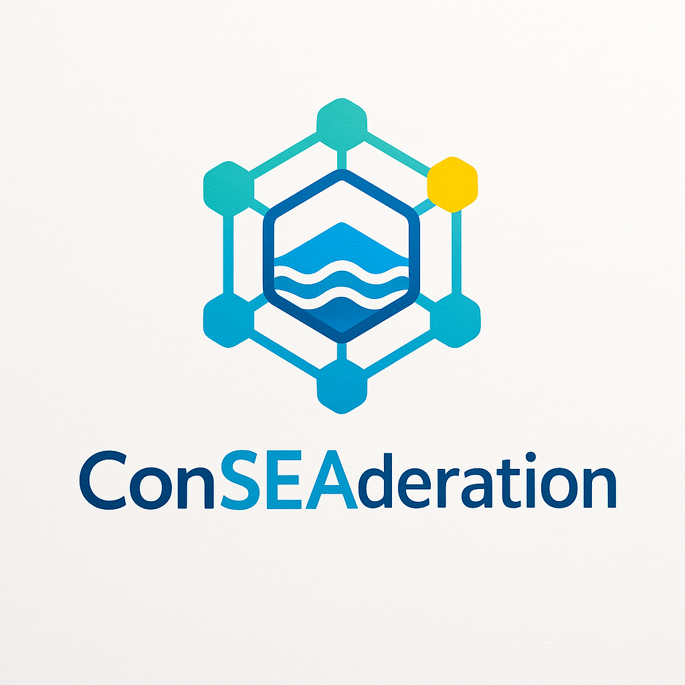
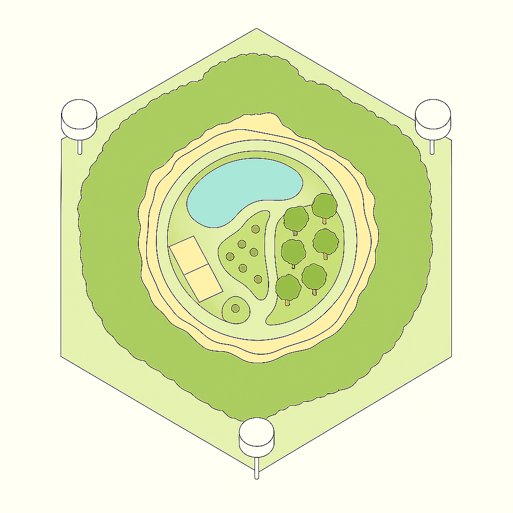

  

# Autonomous Ocean Platform

**Autonomous Ocean Platform** is a comprehensive engineering and biotechnological project for building a fully self-sustaining floating colony for 15 people, designed for decades of independent operation in the open sea.

## Documentation

**🌐 [English Documentation](en/index.md)**  
**🌐 [Русская документация](ru/index.md)**

---

## Key Features

- **Resilient Construction:**  
  Hexagonal SWAHH (Small Waterplane Area Hex Hull) platform, built from glass foam and basalt fiber, with six large ellipsoid columns doubling as wave-energy (OWC) generators.
- **Closed-Loop Systems:**  
  Integrated cycles for water supply, waste, energy, food, hygiene, and materials — everything is produced, recycled, and reused onboard.
- **Multi-Source Renewable Energy:**  
  Wave energy (up to 500 kW peak), solar concentrators, photovoltaic panels, biogas, and robust power storage (iron-nickel batteries, pneumatic accumulators).
- **Autonomous Food Production:**  
  Advanced aquaponics, hydroponics, bioreactors for algae, insect farms, micro-livestock, perennial crops, and genetically stable breeding lines.
- **Onboard Manufacturing:**  
  Local mini-factory for maintenance, repair, and the production of bioplastics, composites, tools, and replacement parts using only platform resources.
- **Zero-Import Hygiene and Chemicals:**  
  All soaps, surfactants, packaging, and sanitary products are produced on the platform using bio-based and biodegradable materials.
- **Fail-Safe Engineering:**  
  Pneumatic and hydraulic automation for all critical systems, manual override for every vital function, and multi-level redundancy for safety and evacuation.
- **Modularity and Scalability:**  
  Designed for construction and maintenance anywhere on the coast, easily scalable to larger populations or linked platforms.

## Sample of the design

  

## Mission

Demonstrate that modern, comfortable, and truly sustainable life is possible at sea — without dependence on external supplies, with minimal environmental impact, and using only technologies reproducible from locally available resources.

---

**For complete technical documentation and in-depth design details, follow the language-specific documentation links above.**
